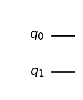
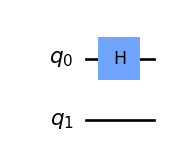
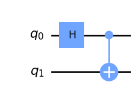
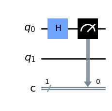

# Where are the other 432?

The story so far: quantum computers run on strange little things called qubits, we can write them as $$2$$D vectors, and the values inside these vectors represent the probabilities of observing them in state $$\ket{0}$$ or $$\ket{1}$$. 

$$
    \ket{\psi} = \alpha\ket{0} + \beta\ket{1} = 
    \alpha\begin{bmatrix} 1 \\ 0 \end{bmatrix} + \beta\begin{bmatrix} 0 \\ 1 \end{bmatrix} = \begin{bmatrix} \alpha \\ \beta \end{bmatrix}
$$

$$
    P(0) = |\alpha|^2\qquad
    P(1) = |\beta|^2
$$

We have also seen how a quantum gate can be applied to a qubit to produce all kinds of funky results. 

$$
    H\ket{0}
    =
    \frac{\ket{0} + \ket{1}}{\sqrt{2}}\qquad
    H\ket{1}
    =
    \frac{\ket{0} - \ket{1}}{\sqrt{2}}
$$

One question you may have at this point is: "We have only seen one qubit, while IBM's largest computer has $$433$$. Where are the other $$432$$?". To answer this question we must think even weirder than before, brace yourself.

*Note:* The original title of this article was "Where are the other $$126$$?" since the largest quantum processor ever built by IBM, 'Eagle', had that many qubits. Funnily enough, during its writing IBM unveiled 'Osprey', a new processor almost quadrupling the amount of qubits 'Eagle' had, taking the record from $$127$$ to $$433$$. We reported this fact as an additional testament of how fast this field is evolving.

## Two Qubits
If we read the value of two classical bits we can find them in four possible configurations: $$00$$, $$01$$, $$10$$, $$11$$. We would like to find something similar in our quantum counterpart. More precisely, we need a way to represent four probabilities, each one relating to one basis state. The natural way of doing so is with a 4D vector. As before, we want our 4 probabilities to sum to 1.

$$
    \ket{\psi} = 
    \begin{bmatrix} 
        \psi_{00} \\ \psi_{01} \\ \psi_{10} \\ \psi_{11}
    \end{bmatrix} \qquad
    P(ij) = |\psi_{ij}|^2 \qquad 
	\sum_{i,j} |\psi_{ij}|^2 = 1
$$

As before, we want our 4 probabilities to sum to $$1$$: $$\sum_{i,j} |\psi_{ij}|^2 = 1$$.
We learned how to write a $$2$$-qubit system, but it's still unclear how you can go from separate qubits to a system of multiple qubits. In other words, how can we "merge" two $$2$$D vectors into a $$4$$D one? You can't simply stack it, the rules of the game are a bit different.

Let's introduce a new friend, the *tensor product*, also called *Kronecker product* (*Note:* Kronecker and tensor products are actually two different guys, but they almost look alike. In this article we won't go into the difference but keep it in mind if you meet them elsewhere). The *Kronecker product* takes two vectors, matrices or also simple numbers and multiplies every number in the first "object" with every number in the second one. This works between matrices and vectors of all sizes! For example, with vectors of length 3 and 2 respectively:

$$
    \ket{A} \otimes \ket{B} = 
    \begin{bmatrix} 
        a_1 \\ a_2 \\ a_3 
    \end{bmatrix} \otimes
    \begin{bmatrix} 
        b_1 \\ b_2
    \end{bmatrix} =
    \begin{bmatrix} 
        a_1 \cdot b_1 \\ a_1 \cdot b_2 \\ 
        a_2 \cdot b_1 \\ a_2 \cdot b_2 \\
        a_3 \cdot b_1 \\ a_3 \cdot b_2 \\
\end{bmatrix}
$$

As a side note, this also works between matrices and vectors of all sizes!

Back to our quantum problem, the way we build a $$2$$ qubit system is by applying the *Kronecker product* to two qubits. Assuming $$\ket{\psi}$$ and $$\ket{\phi}$$ are qubits:

$$
    \ket{\psi} \otimes \ket{\phi} = 
    \begin{bmatrix} 
        \psi_0 \\ \psi_1 
    \end{bmatrix} \otimes
    \begin{bmatrix} 
        \phi_0 \\ \phi_1
    \end{bmatrix} =
    \begin{bmatrix} 
        \psi_0 \cdot \phi_0 \\ \psi_0 \cdot \phi_1 \\ 
        \psi_1 \cdot \phi_0 \\ \psi_1 \cdot \phi_1 \\
\end{bmatrix}
$$

Why do we care about this? Because it tells us how different qubit probabilities interact with each other to build larger systems. And the way they do is with simple products (for now...). What about $$n$$ qubits? Since $$n$$ classical bits can assume $$2^n$$ different configurations, we expect $$n$$ qubits to have $$2^n$$ different base states. To represent these many states we need a long state vector, $$2^n$$ elements long to be precise. If you're still not convinced, try computing the *Kronecker product* between more than two qubits. 

## Multiple-qubit gates
To manipulate big qubit systems we need big quantum gates. And they are defined in pretty much the same way as before. For an $$n$$ qubit system, we can write them as Hermitian matrices of size $$2^n\times2^n$$. 

The most common quantum gate with more than a qubit is the CNOT gate, or Controlled Not. This gate takes two qubits as input: the first is the control one, the second is the target. The behaviour is quite simple: if the control qubit is set to $$\ket{0}$$ then nothing happens to the other qubit, viceversa if the control qubit is set to $$\ket{1}$$, then the target qubit is flipped. Mathematically:

$$
\ket{00}\to\ket{00}
$$

$$
\ket{01}\to\ket{01}
$$

$$
\ket{10}\to\ket{11}
$$

$$
\ket{11}\to\ket{10}
$$

Note how this is a generalization of the XOR gate: the control bit and the target bit are XOR-ed and the result is stored in the target bit.
We can easily describe the CNOT gate in matricial form:

$$
    U_{CN}=\begin{bmatrix}
    1&0&0&0\\
    0&1&0&0\\
    0&0&0&1\\
    0&0&1&0
    \end{bmatrix}
$$

You may have heard all classical computers are made of NAND gates. It has been shown that by cleverly combining NAND gates you can create all the other logical gates. It is thus cheaper, simpler and more efficient to create many NAND gates and wire them up correctly rather than building many different gates. The CNOT gate is the equivalent of the quantum world. It can be proven that all multiple qubit gates can be composed from a CNOT and single qubit gates, hence it is the perfect candidate for building quantum computers.

One question you may have at this point is: "why quantum gates need to return the same number of values as their input?". After all, classical gates don't have this requirement. A simple XOR gate takes two inputs but return only one. So why is it that the CNOT can't also return simply its second qubit? It turns out the answer is deeply rooted in how quantum mechanics works. I could mathematically write a non-square matrix returning just the qubit I need (that would be quite simple), but it would not be possible to physically create such gate. Quantum computing is largely separated from its physical meaning, a qubit can be an electron, a photon an ion (or even a cat) and we wouldn't care too much since the behaviour would be the same. But in order to respect the axioms of quantum mechanics, we must force this constraint. There is, however, one (sort of) exception, and this is *measurement*. 

Measurement has quite a deep meaning in quantum computing, that's the process of forcing a qubit to *take a decision*. If we have a two qubit system we can measure separately the two composing qubits. For example, given a qubit in the form: 

$$
\ket{\psi}=\psi_{00}\ket{00} + \psi_{01}\ket{01} + \psi_{10}\ket{10} + \psi_{11}\ket{11}
$$

a measurement of the first qubit would give $$0$$ with probability 
$$|\psi_{00}|^2+|\psi_{01}|^2$$ (all the states in which the first qubit is zero). As a consequence the states $$\ket{10}$$ and $$\ket{11}$$ would have probability $$0$$, but since all probabilities must sum to one we will be left with the state after measurement:

$$
\ket{\psi}=\frac{\psi_{00}\ket{00} + \psi_{01}\ket{01}}{\sqrt{|\psi_{00}|^2+|\psi_{01}|^2}}
$$

which in mathematical terms consists of normalizing what's remaining so that everything keeps summing up to one. Normalization of the remaining qubits always happens after you measure one of them. Measurement is a fundamental concept one needs to understand to really grasp quantum mechanics. However, for now, we prefer not to overload you with information. We'll give a detailed explanation of measurements in a future article.

## A spooky phenomenon
On a similar note let's imagine having this 2-qubit system:

$$
	\ket{\psi} =
	\begin{bmatrix}
	\psi_{00}  \\
	\psi_{01}  \\
	\psi_{10}  \\
	\psi_{11}  \\
	\end{bmatrix}
	=
	\begin{bmatrix}
	0  \\
	1  \\
	1  \\
	0  \\
	\end{bmatrix}\frac{1}{\sqrt{2}}
$$

Are you able to find the correct coefficients $$\alpha_0, \alpha_1, \beta_0, \beta_1$$ of two separate qubits to build it with a tensor product?

$$
    \ket{\psi} = 
    \begin{bmatrix} 
        \alpha_0 \\ \alpha_1 
    \end{bmatrix} \otimes
    \begin{bmatrix} 
        \beta_0 \\ \beta_1
    \end{bmatrix} 
	=
	\begin{bmatrix}
	0  \\
	1  \\
	1  \\
	0  \\
	\end{bmatrix}\frac{1}{\sqrt{2}}
$$ 

*Spoiler*: you can't. 
An even stranger thing: what happens if you read the first qubit and observe a $$0$$? You must be either in configuration $$\ket{00}$$ or $$\ket{01}$$, but the probability of the first configuration is $$0$$... The opposite happens if you instead observe a $$1$$ on the first qubit.
By collapsing the wave function of the first qubit we instantly reduced the probability of some state on the other qubit to $$0$$. It means that also the second unmeasured qubit collapsed without us ever touching it! This behavior is a manifestation of an important quantum phenomenon with deep implications and it's known as *entanglement*. While this deserves an article on its own we can say in short that when two qubits are entagled they are strongly correlated: measuring the first implies a measuremnent of the second and viceversa. This correlation is very strong and no matter how far we separate these qubits (remember qubits can be atoms, ions, cats), they will always be entangled. This can lead to very weird stuff, like teleportation. There are fundamental differences between entanglement and correlation, so remember that this analogy is not mathematically accurate. 

*Note:* [Here](https://physics.stackexchange.com/questions/561382/what-exactly-is-the-difference-between-entanglement-and-correlations) you can find more about the difference between correlation and entanglement.

## Quantum Circuits
Now that we have talked about multiple qubit systems, we can start to imagine that as the complexity grows, it becomes exponentially difficult to represent every operation in matricial form. For this reason we introduce here the concept of quantum circuits. This is a concise way to represent one or multiple operations on a qubit system, and is also a clever way of devising new quantum algorithms. For example, in the figure below we can see the simplest quantum circuit for a 2-qubit system:

<i>Figure 1: A simple quantum circuit.</i>

In the diagram we have the two qubits $$q_0$$ and $$q_1$$ represented as two horizontal lines: these are the equivalent of wires in the quantum world and connect consecutive operations on that same qubit. These are not physical wires, but rather *logical ones*, they can represent the passing of time, or photons moving from one point to another. The point of plotting a circuit is that we can easily see where and how gates are applied. Let's do this for a Hadamard: 

<i>Figure 2: Hadamard gate applied to the first qubit.</i>

In this case, we apply the Hadamard gate to the first qubit without touching the second (if you don't remember what this gate does, we already introduced it in a [previous article](https://the-quantumist.github.io/2022/11/01/quantum-computing-for-computer-engineers-part-1.html)). Of course, we can do the same with the new shiny gate that we just learnt, the CNOT:

<i>Figure 3: CNOT with first qubit as the control.</i>

Observe how this gate visually takes two wires as input and outputs two wires as output. The "dot" shape indicates that $$q_0$$ is the controlling qubit, while the "plus" shape indicates that $$q_1$$ is the controlled one. The next step is to combine multiple gates and create more complex circuits:

<i>Figure 4: A more complicated circuit.</i>

As an exercise, you can do the math yourself and show that this circuit can be used to create entangled states! Simply take any 2-qubit state and apply the matrix representing the circuit to it. As a hint, the matrix is $U_{CN}(H \otimes I)$. Note how this time we apply the Kronecker product to matrices. Finally, we can represent the operation of measurement:

<i>Figure 5: Measuring the first qubit.</i>

we are measuring just the first qubit after the Hadamard and saving the output in a standard 1-bit register $$c$$, denoted as a double wire.
This notion of quantum circuits will become particularly useful in the future when we'll introduce more complex applications and properties.

## Conclusion
That's all for this second article about the basics of quantum computing, in the next ones we will focus deeper on the concepts of measurement and entaglement (that's a lot of cool stuff). If you liked the article or you have any question and/or suggestion, feel free to leave a comment. Until next time!
