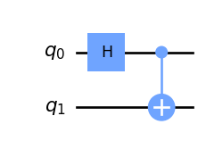

# So far, yet so close

Imagine you have two bowling balls, one is black and one is white. You put these balls in two boxes, mix them up, and now you can't tell which box contains which ball. Let's suppose you gift one box to your friend who is about to leave for a very long journey to Proxima Centauri. After some years you crack open the remaining box and  voila - you find the black ball inside. In this exact moment you automagically know that in the other box, which now is in proxima centauri, there is a white ball (assuming it did not get destroyed by aliens on its dangerous journey). How incredible is that? Probably your answer is "not much", it's something quite normal. Is there any quantum weirdness going on? Definitely not, it's just good ol' correlation at work. We can safely say that the result of the measurements are $$100\%$$ correlated but there is nothing we cannot explain with normal probability.

Let's take the previous experiment up a notch, shall we? This time, instead of bowling balls, we're using two coins. But wait, there's a twist - we're making these coins spin with so much force that they'll keep spinning indefinitely (or until we ruin the fun by touching them). While the coins are still spinning, we toss them into two boxes. But that's not all. We also run these boxes through a special machine that can link the coins in a mysterious way while they're still spinning. This link ensures that if we open one box, touch the coin inside and measure which side it lands (say, heads), the other coin - when we touch it - will land on the opposite side (tails), and vice versa. Sounds impossible, right?

Here's what would happen if we repeat the previous experiment: if we ship one box to Proxima Centauri and, after some time, we measure the other box's coin, we'll instantly know which side the coin in the faraway box has landed on. This, my friend, is what we call *entanglement*. The difference between the bowling balls and the coins is that with the balls, we already knew which one was black and which one was white. But with the coins, we didn't know ahead of time which side they would land, only that they would be opposite of each other. Since a coin can have a $$50/50$$ chance of landing on heads or tails, while still spinning it can be considered to be in both states at the same time - just like a qubit is in a superposition of two states.

Does this mean that the coins are communicating instantly no matter their distance, even faster than the speed of light? Well, yes and no. In a certain sense the coins are linked in a way that is non-dependent on their relative position: if one lands on the head the other will land on the tail. This is the so called *non-locality principle*. Unfortunately, we cannot use this phenomenon to communicate instantly: our friend on Proxima Centauri won't know the result of our measurement if we don't tell them in a conventional way, nor will they know whether or not our coin is still spinning. The only thing they'll know is that if they measure head, you will measure tail and viceversa, just like with the balls. So no ways to "hack" the universe, unfortunately the no free lunch theorem is still valid. Does this mean entanglement is useless? Definitely not! On the contrary, it is a very important phenomenon with many uses. Through this article we are going to better define how it works, walk you through the math, and show you one possible application. 

## Bell States
Let's now introduce the concept of entanglement in a more formal way through the so called *Bell states*. Bell states are four specific two-qubit systems that cannot be created by simply combining two one-qubit systems. How can we go about creating one then?

<i>Figure 1: The Bell states circuit.</i>

Pretty confusing, right? Let's do the math step by step. First of all remember that the Hadamard gate can be described in this form:

$$
    H = \frac{1}{\sqrt{2}}\begin{bmatrix}
    1 & 1 \\
    1 & -1
    \end{bmatrix}
$$

But, wait a second! The Hadamard gate is a single qubit gate, how can we apply it to a qubit system? We should find a way to build a two-qubit gate that applies the Hadamard just to the first without toching the second. We can see the situation as having two single qubit gates acting in parallel, the Hadamard (on the first) and the identity gate (on the second). As we saw in another [previous article](https://the-quantumist.github.io/2023/01/31/quantum-computing-for-computer-engineers-part-2.html), we can go from a single qubit system to a multiple qubit system by applying the Kronecker product. The good news is that we can do the same to combine two single qubit gates in parallel into one multiple qubit gate:

$$
H \otimes I = \frac{1}{\sqrt{2}}\begin{bmatrix}
    1 & 1 \\
    1 & -1
    \end{bmatrix} \otimes \begin{bmatrix}
    1 & 0 \\
    0 & 1
    \end{bmatrix} = \frac{1}{\sqrt{2}}
\begin{bmatrix}
    1&0&1&0\\
    0&1&0&1\\
    1&0&-1&0\\
    0&1&0&-1
\end{bmatrix}
$$

This is a general rule that becomes very handy to put gates in parallel. Now let's suppose our $$\ket{\psi}$$ system is the state $$\ket{00}$$, meaning that we are $$100\%$$ sure both qubits are zero. In formulas, $$\ket{\psi} = [1, 0, 0, 0]^T$$. Then, we can apply the $$H$$ to the first qubit, thus obtaining:

$$
\ket{\psi_H} = 
(H \otimes I)\ket{\psi} =
\frac{1}{\sqrt{2}}
\begin{bmatrix}
    1&0&1&0\\
    0&1&0&1\\
    1&0&-1&0\\
    0&1&0&-1
\end{bmatrix}
\begin{bmatrix}
  1 \\
  0 \\
  0 \\
  0 \\
\end{bmatrix} = 
\frac{1}{\sqrt{2}}
\begin{bmatrix}
  1 \\
  0 \\
  1 \\
  0 \\
\end{bmatrix}
$$

Now let's take the full state and apply the CNOT gate $$U_{CN}$$, this time in *series*, so instead of the Kronecker product we use a matrix multiplication:

$$
\begin{align*}
\ket{\psi_{HCN}} & = \frac{1}{\sqrt{2}} U_{CN}\ket{\psi_H}
= \begin{bmatrix}
    1&0&0&0\\
    0&1&0&0\\
    0&0&0&1\\
    0&0&1&0
\end{bmatrix}
\frac{1}{\sqrt{2}}
\begin{bmatrix}
  1 \\
  0 \\
  1 \\
  0 \\
\end{bmatrix}  \\
& = \frac{1}{\sqrt{2}}
\begin{bmatrix}
  1 \\
  0 \\
  0 \\
  1 \\
\end{bmatrix} =
\frac{\ket{00}+\ket{11}}{\sqrt{2}}
\end{align*}
$$

That's one of the Bell States, the others are obtained in an analogous way by applying the same gates $$U_{CN} (H \otimes I)$$ to the other *basis states*: 

| Input ($$\ket{\psi}$$)      | Output ($$\ket{\psi_{HCN}}$$) |
| ----------- | ----------- |
| $$\ket{00}$$ | $$\frac{\ket{00}+\ket{11}}{\sqrt{2}}$$ |
| $$\ket{01}$$ | $$\frac{\ket{01}+\ket{10}}{\sqrt{2}}$$ |
| $$\ket{10}$$ | $$\frac{\ket{00}-\ket{11}}{\sqrt{2}}$$ |
| $$\ket{11}$$ | $$\frac{\ket{01}-\ket{11}}{\sqrt{2}}$$ |

Pretty complicated, right? We strongly believe that the best way to learn this sort of things in quantum computing is to sit down and do the math. We recommend taking your time to redo the calculations with pen and paper for the other states to check for yourself that everything is right. Of course this process becomes cumbersome as we consider larger systems, but it's worth the effort for small examples, to get the concept right. 

A question you may have is: "Ok, we have these fancy states, but why are they so important?"
Let's take a closer look at the state $$\frac{\ket{00}+\ket{11}}{\sqrt{2}}$$. It describes a two qubit system which can be observed with $$50\%$$ probability in state $$00$$ and with $$50\%$$ in state $$11$$. This means that if we measure independently the first qubit and observe $$0$$, then also the second qubit will be $$0$$, viceversa if we measure $$1$$ we will also observe $$1$$ on the second qubit. These qubits are therefore linked: we don't know their states a priori, but we know that when measured they will yield the same result! As explained in the introduction, this relationship holds no matter how far these two qubits are in space or time, and it's due to what quantum physicists call **non-locality principle**. With a bunch of linear algebra we were able to describe mathematically such a deep and mysterious concept that regulates the universe, how cool is that?

Things become even more interesting if we try to split the two qubits. Given 

$$
	\ket{\psi_{HCN}} =
	\begin{bmatrix}
	\psi_{00}  \\
	\psi_{01}  \\
	\psi_{10}  \\
	\psi_{11}  \\
	\end{bmatrix}
	=
	\begin{bmatrix}
	1  \\
	0  \\
	0  \\
	1  \\
	\end{bmatrix}\frac{1}{\sqrt{2}}
$$

Can we find the coefficients $$\psi_{ij}$$ such that we are able to write the system as the Kronecker product of the two qubits? As we already described in the previous article, we can't. This means we cannot obtain a Bell state by simply considering two separate qubits as one system. Instead, we necessarily need to construct them via quantum gates. The result is two objects that cannot be described on their own. This impossibility explains the difference between bowling balls and spinning coins, it's something classical probability simply cannot describe and that's the reason we look at the quantum formalism instead.

## Superdense coding

Now, let's use the concept we just learnt to do something concrete! We will show that by using the Bell states we can send two bits of information by transmitting just one qubit. The setup looks like this: we have two friends, Alice and Bob, that want to share some information over a "quantum wire". They each receive beforehand one qubit of the entangled Bell state $$\ket{\psi_0} = \frac{\ket{00} + \ket{11}}{\sqrt{2}}$$. Alice then modifies her qubit in a smart way to codify two classical bits, obtaining $$\ket{\psi_1}$$, and sends it to Bob. Bob compares his qubit with the one he has received from Alice and immediately recognizes the two bits Alice wanted him to have, obtaining the state $$\ket{\psi_2}$$. It's true that Bob received two qubits overall, but the information did not yet exist when he received the first one. We can see superdense coding as a way of sharing an "information credit" ahead of time, and then spend it at the right moment by sending half the qubits we normally would.
An example of a quantum circuit able to do this kind of magic is shown in Figure 2, where $$q_{Alice}$$ and $$q_{Bob}$$ both start in the state $$\ket{00}$$ (they are both $$0$$ with $$100\%$$ probability).

<i>Figure 2: The superdense coding circuit.</i>

Let's do the math step by step. The first part is easy: we start from the state $$\ket{00}$$ and we apply the Bell circuit to obtain $$\frac{\ket{00} + \ket{11}}{\sqrt{2}}$$. Now, suppose Alice wants to send two classical bits $$01$$ to Bob. To do that, she applies a $$Z$$ gate to her qubit; this is a single qubit gate that can be written as:

$$
Z=\begin{bmatrix}
1 & 0 \\
0 & -1 \\
\end{bmatrix}
$$

Remember we are in a two qubit system so to apply the $$Z$$ gate to the fist qubit means to apply the identity gate to the second in parallel. We can do this even though the two qubits are separated, this is simply a way of representing operations on the system as a whole and does not depend on the position in space of its constituent qubits. The resulting gate can be derived with the Kronecker product:

$$
Z\otimes I = \begin{bmatrix}
1 & 0 \\
0 & -1 \\
\end{bmatrix} \otimes \begin{bmatrix}
1 & 0 \\
0 & 1 \\
\end{bmatrix} =
\begin{bmatrix}
1 & 0 & 0 & 0 \\
0 & 1 & 0 & 0 \\
0 & 0 & -1 & 0 \\
0 & 0 & 0 & -1 \\
\end{bmatrix}
$$

Now let's pass the system through the gate:

$$
\begin{align*}
	(Z\otimes I) \ket{\psi_0} &=
	\begin{bmatrix}
	1 & 0 & 0 & 0 \\
	0 & 1 & 0 & 0 \\
	0 & 0 & -1 & 0 \\
	0 & 0 & 0 & -1 \\
	\end{bmatrix}\frac{1}{\sqrt{2}}\begin{bmatrix}
	1  \\
	0  \\
	0  \\
	1  \\
	\end{bmatrix}\\ 
    & = 
	\frac{1}{\sqrt{2}}\begin{bmatrix}
	1  \\
	0  \\
	0  \\
	-1  \\
	\end{bmatrix} = \frac{\ket{00} - \ket{11}}{\sqrt{2}}\\
    & =
	\ket{\psi_1}
\end{align*}
$$
 
Note how Alice, by modifying her qubit, is able to modify the whole system. Now she sends her qubit to Bob. All that is left to do for Bob is to extract the information encoded by Alice and measure the system. In other words Bob needs to go from this Bell state $$\ket{\psi_1}$$ to one where the outcome is certain. How can he do that? Well, rember from the first article that all quantum gates are reversible? Bob can apply the inverse of the gates used in the previous section to revert the entanglement while keeping the effect of the $$Z$$ gate used by Alice, thus going back to the basis state. This means a CNOT on both qubits followed by an Hadamard gate on the first one.

After the CNOT, we get:

$$
U_{CN} \ket{\psi_1} = \begin{bmatrix}
    1&0&0&0\\
    0&1&0&0\\
    0&0&0&1\\
    0&0&1&0
\end{bmatrix}\frac{1}{\sqrt{2}}\begin{bmatrix}
	1  \\
	0  \\
	0  \\
	-1  \\
	\end{bmatrix} =
  \frac{1}{\sqrt{2}}\begin{bmatrix}
	1  \\
	0  \\
	-1  \\
	0  \\
	\end{bmatrix}
$$

And afther the Hadamard on the first qubit (same gate used in the first section):

$$
\begin{align*}
\ket{\psi_2} &=
 (H \otimes I) \frac{1}{\sqrt{2}}\begin{bmatrix}
	1  \\
	0  \\
	-1  \\
	0  \\
	\end{bmatrix}
\frac{1}{\sqrt{2}} =
\frac{1}{2} 
\begin{bmatrix}
    1&0&1&0\\
    0&1&0&1\\
    1&0&-1&0\\
    0&1&0&-1
\end{bmatrix}
\begin{bmatrix}
	1  \\
	0  \\
	-1  \\
	0  \\
\end{bmatrix} \\ 
& =
\frac{1}{2} 
\begin{bmatrix}
	0  \\
	0  \\
	2  \\
	0  \\
	\end{bmatrix}=
\begin{bmatrix}
	0  \\
	0  \\
	1  \\
	0  \\
	\end{bmatrix}
= \ket{01}
\end{align*}
$$

Now Bob can measure the system and get $$01$$ with probability $$100\%$$. Alice was thus able to send two bits of information, just by sending one qubit! That's superdense coding.

Now you would ask: "Ok, this works for $$01$$. What about the other values?". Alice can encode the 4 different values $$00$$, $$01$$, $$10$$, $$11$$ simply by changing the initial gate that is applied to her entangled qubit. This results in a different Bell state for every choice, that Bob can then revert back to a clear answer. Here is a table showing all the combinations:

| Value to encode     | Gate to apply to first qubit | Resulting state |
| ----------- | ----------- | ----------- |
| $$00$$ | $$I=\begin{bmatrix}1 & 0 \\ 0 & 1\end{bmatrix}$$ | $$\frac{\ket{00} + \ket{11}}{2}$$ |
| $$01$$ | $$Z=\begin{bmatrix}1 & 0 \\ 0 & -1\end{bmatrix}$$ | $$\frac{\ket{00} - \ket{11}}{2}$$ |
| $$10$$ | $$X=\begin{bmatrix}0 & 1 \\ 1 & 0\end{bmatrix}$$ | $$\frac{\ket{10} + \ket{01}}{2}$$ |
| $$11$$ | $$ZX=\begin{bmatrix}0 & 1 \\ -1 & 0\end{bmatrix}$$ | $$\frac{\ket{01} - \ket{10}}{2}$$ |

where $$X$$ (or Pauli-$$X$$) is simply the one-qubit NOT gate.

Given the different Bell states, Bob can then decode the values in the same way we saw for the particular case of $$01$$. We suggest you do the math for the other three possibilities, to be sure Bob decodes the right value.

A final remark you may have is: "This notation is rather cumbersome, can we use the $$H$$ gate directly on a qubit instead of using $$H \otimes I$$"?. The answer is no, and the reason was already given earlier: since the two qubits are entangled, they cannot be expressed as a tensor product of two separate systems. All operations on an entangled pair must be mathematically computed on the full system even if they involve only one of the qubits. This gives another hint as why quantum computers are powerful: we can use the properties of entanglement without having to represent a matrix of exponential size. All we need are the smaller gates.

## Conclusion

Quite a lot of stuff we saw in this episode! Here we introduced one of the most important concepts in quantum physics, and we showed with a fair bit of math how to apply it for quantum computing. The superdense coding example is one of many applications of entanglement in quantum theory. Another weird and fascinating thing we can do with it is teleporting qubits! We are eager to cover more on the topic in following articles.

## Sources

Nielsen, M., & Chuang, I. (2010). Quantum Computation and Quantum Information: 10th Anniversary Edition. Cambridge: Cambridge University Press. doi:10.1017/CBO9780511976667