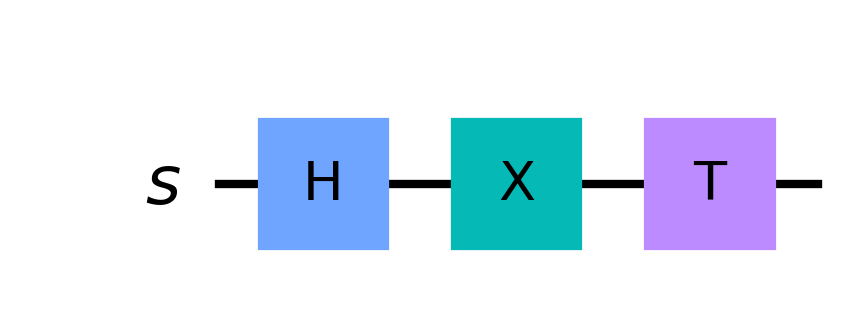
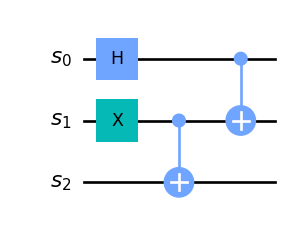

# A handbook for understanding quantum math in articles

We all agree that quantum mechanics is weird and fascinating: it can teleport information, connect particles across space and time, and even speed up computations that would take centuries. Our mission at The Quantumist is to make this field a bit more accessible by walking you through the steps and reasonings in a colloquial manner. However, one cannot fully grasp what is going on under the hood without understanding some of the math. We believe math can be seen as a game, and the "rules" of this game determine the symbols you can write and how you can manupulate them. The purpose of this article is to serve as a cheat-sheet for the basic rules that apply when dealing with the math of quantum computing, and is intended for people that want to get their hands dirty. We will expand it in the future with additional notions and tricks we deem useful.

## Matrix multiplication refresher

This section is intended as a light refresh on one basic linear algebra concept that is fundamental for understanding the rest of the article. Feel free to skip it if you feel you already know these notions.

Matrix multiplication is a basic operation useful to understand how quantum states evolve and how quantum gates combine with each other. To perform a matrix multiplication we of course need two matrices to multiply, $$A$$ and $$B$$, and we call the resulting matrix $$C$$. We define $$A$$ to be of generic size $$(m \times n)$$ ($$m$$ rows, $$n$$ columns), while $$B$$ is of generic size $$(k \times l)$$. $$A$$ and $$B$$ can contain any kind of numbers, in our example we choose real numbers for simplicity ($$\mathbb{R}$$) but quantum computing utilizes complex values ($$\mathbb{C}$$). For now, not much is lost in limiting ourselves to real numbers. Back to our matrices, the size we choose for them is important, as we can only perform a matrix product $$A \cdot B$$ if the inner dimensions of the product match. In other words, we can only multiply matrices of size $$(m \times{\color{red}n})$$ and $$({\color{red}k} \times l)$$ if $$\color{red}{n = k}$$. 

Now, let's see how we can actually compute the matrix product. The generic element $$c_{ij}$$ of $$C$$ in row $$i$$ and column $$j$$ is computed as the scalar product of the $$i$$-th row of $$A$$ with the $$j$$-th column of $$B$$. This is also a mnemonic trick: "To compute the element in the $$\color{red}\text{third row}$$, $$\color{blue}\text{second column}$$ of $$C$$, you must use the $$\color{red}\text{third row}$$ of $$A$$ and the $$\color{blue}\text{second column}$$ of $$B$$".

$$
A \cdot B =
\begin{bmatrix}
    a_{11} & \ldots & a_{1n} \\
    \vdots & \ddots & \vdots \\
	a_{m1} & \ldots & a_{mn} \\
\end{bmatrix} \cdot
\begin{bmatrix}
    b_{11} & \ldots & b_{1l} \\
    \vdots & \ddots & \vdots \\
	b_{k1} & \ldots & b_{kl} \\
\end{bmatrix} =
\begin{bmatrix}
    c_{11} & \ldots & c_{1l} \\
    \vdots & \ddots & \vdots \\
	c_{m1} & \ldots & c_{ml} \\
\end{bmatrix} = C
$$

$$
c_{ij} \mathrel{\vcenter{:}}= \sum_{x=0}^{n} a_{ix} \cdot b_{jx}
$$

As an example, let's take a look at the following, with $$m = n = k = 3$$ and $$l = 2$$, in particular let's show how to obtain element $$\color[rgb]{0.7,0,0.7}c_{32}$$:

$$
A \cdot B =
\begin{bmatrix}
    1 & 3 & 1 \\
    4 & 3 & 1 \\
	\color{red}2 & \color{red}1 & \color{red}2 \\
\end{bmatrix} \cdot
\begin{bmatrix}
    1 & \color{blue}0 \\
    4 & \color{blue}1 \\
	3 & \color{blue}3 \\
\end{bmatrix} =
\begin{bmatrix}
    16 & 6 \\
    19 & 6 \\
	12 & \color[rgb]{0.7,0,0.7}7 \\
\end{bmatrix} = C
$$

$$
c_{32} = {\color{red}2} \cdot {\color{blue}0} + {\color{red}1} \cdot {\color{blue}1} + {\color{red}2} \cdot {\color{blue}3} = {\color[rgb]{0.7,0,0.7}7}
$$

Note that $$n = k$$ was important in order to have vectors of the same length in the computation for $$c_{ij}$$.

## Matrix notation

### A recap of quantum gates
Just as classical computers have logical gates to manipulate information, quantum computers have quantum gates. They serve the purpose of manipulating quantum states - effectively changing the shape of the probability distribution - in order to express some logical function. All quantum gates - and all quantum operators at large - act in a linear fashion. This means we can represent them in a matrix form. Moreover, every generic gate $$U$$ is *unitary*, meaning it preserves the total probability sum of the state to $$1$$ ($$U^{\dagger}U = UU^{\dagger} = I$$). All quantum gates are also *reversible*, meaning that the input can be unambiguously reconstructed from its output. By contrast, a classical XOR gate is irreversible since its output $$0$$ can be obtained by both $$11$$ and $$00$$. Here is a table summarizing the main single and multi-qubit quantum gates:

| Gate       | Symbol   | Matrix form                                          |
|------------|----------|------------------------------------------------------|
| Identity   | $$I$$      | $$\begin{bmatrix} 1 & 0 \\ 0 & 1\end{bmatrix}$$         |
| Pauli-X    | $$X$$      | $$\begin{bmatrix} 0 & 1 \\ 1 & 0\end{bmatrix}$$         |
| Pauli-Y    | $$Y$$      | $$\begin{bmatrix} 0 & -i \\ i & 0\end{bmatrix}$$        |
| Pauli-Z    | $$Z$$      | $$\begin{bmatrix} 1 & 0 \\ 0 & -1\end{bmatrix}$$        |
| Hadamard   | $$H$$      | $$\frac{1}{\sqrt{2}}\begin{bmatrix} 1 & 1 \\ 1 & -1\end{bmatrix}$$ |
| $$\varphi$$ Phase Shift    | $$P(\varphi)$$      | $$\begin{bmatrix} 1 & 0 \\ 0 & e^{i\varphi}\end{bmatrix}$$ |
| CNOT       | $$\text{CNOT}$$         | $$\begin{bmatrix} 1 & 0 & 0 & 0 \\ 0 & 1 & 0 & 0 \\ 0 & 0 & 0 & 1 \\ 0 & 0 & 1 & 0 \end{bmatrix}$$ |
| SWAP       | $$\text{SWAP}$$         | $$\begin{bmatrix} 1 & 0 & 0 & 0 \\ 0 & 0 & 1 & 0 \\ 0 & 1 & 0 & 0 \\ 0 & 0 & 0 & 1 \end{bmatrix}$$ |
| Controlled-Z | $$CZ$$   | $$\begin{bmatrix} 1 & 0 & 0 & 0 \\ 0 & 1 & 0 & 0 \\ 0 & 0 & 1 & 0 \\ 0 & 0 & 0 & -1 \end{bmatrix}$$ |
| Toffoli    | $$CCX$$    | $$\begin{bmatrix} 1 & 0 & 0 & 0 & 0 & 0 & 0 & 0 \\ 0 & 1 & 0 & 0 & 0 & 0 & 0 & 0 \\ 0 & 0 & 1 & 0 & 0 & 0 & 0 & 0 \\ 0 & 0 & 0 & 1 & 0 & 0 & 0 & 0 \\ 0 & 0 & 0 & 0 & 1 & 0 & 0 & 0 \\ 0 & 0 & 0 & 0 & 0 & 1 & 0 & 0 \\ 0 & 0 & 0 & 0 & 0 & 0 & 0 & 1 \\ 0 & 0 & 0 & 0 & 0 & 0 & 1 & 0 \end{bmatrix}$$ |

### Applying quantum gates in matrix form
The result of applying a quantum gate to a state can be calculated simply as a matrix multiplication of the gate with the state. The effect of a gate can be easily understood once one visualizes the problem using linear algebra. To this regard, we recommend an excellent and intuitive explanation of these concepts: 3Blue1Brown's [Essence of linear algebra](https://www.youtube.com/playlist?list=PLZHQObOWTQDPD3MizzM2xVFitgF8hE_ab). 

An intuition coming from linear algebra is that gates in matrix formulation are a map to where the base states end up. Let's take a look at the following example with a Pauli-Y gate on the $$\ket{0} = [1, 0]^T$$ state:

$$
Y\ket{0} =
\begin{bmatrix} 
	\color{red}0 & -i \\ 
	\color{red}i & 0
\end{bmatrix}
\begin{bmatrix} 
	1 \\ 
	0
\end{bmatrix} =
\begin{bmatrix} 
	\color{red}0 \\ 
	\color{red}i
\end{bmatrix}
$$

Observe how the final output corresponds to the $$\color{red}\text{first column of } Y$$. This is trivial, since state $$\ket{0}$$ had a single $$1$$ in the first position. This, however, is a very useful detail to notice, as it's valid for gates and states of any size. Moreover, if your state is not a pure state (e.g. not $$\ket{0}$$ or $$\ket{1}$$), you can still compute the output as a sum of base states. The values of the state tells you "how much" of every column to use for composing your state. For example, if we apply the Pauly-Y gate to the superposed state $$\ket{+} = \frac{1}{\sqrt{2}}[1, 1]^T$$, we obtain:

$$
Y\ket{+} =
\begin{bmatrix} 
	\color{red}0 & \color{blue}-i \\ 
	\color{red}i & \color{blue}0
\end{bmatrix}
\begin{bmatrix} 
	1 \\ 
	1
\end{bmatrix}\frac{1}{\sqrt{2}} =
\frac{1}{\sqrt{2}}
\begin{bmatrix} 
	\color{red}0 \\ 
	\color{red}i
\end{bmatrix} +
\frac{1}{\sqrt{2}}
\begin{bmatrix} 
	\color{blue}-i \\ 
	\color{blue}0
\end{bmatrix} =
\frac{1}{\sqrt{2}}
\begin{bmatrix} 
	\color[rgb]{0.7,0,0.7}-i \\ 
	\color[rgb]{0.7,0,0.7}i
\end{bmatrix}
$$

Let's make a final example with a CNOT gate applied to a larger, 2-qubit state: 

$$
\text{CNOT}(\ket{00} + \ket{11}) = 
\begin{bmatrix} 
	1 & 0 & 0 & 0 \\ 
	0 & 1 & 0 & 0 \\ 
	0 & 0 & 0 & 1 \\ 
	0 & 0 & 1 & 0 
\end{bmatrix} 
\begin{pmatrix} 
	\begin{bmatrix} 
	1 \\ 
	0 \\ 
	0 \\ 
	0 
	\end{bmatrix} + 
		\begin{bmatrix} 
	0 \\ 
	0 \\ 
	0 \\ 
	1 
	\end{bmatrix}
\end{pmatrix} =
\begin{bmatrix} 
	1 \\ 
	0 \\ 
	0 \\ 
	0 
\end{bmatrix} + 
\begin{bmatrix} 
	0 \\ 
	0 \\ 
	1 \\ 
	0 
\end{bmatrix} =
\ket{00} + \ket{10}
$$

## Dirac notation

### Quantum states in Dirac notation

Doing the math in matrix notation can get out of hand very quickly. Let's take the case of a qubit system made of three $$\ket{0}$$ states. We represent this in matrix notation as a tensor product of three 2-dimensional vectors:

$$
    \ket{0} \otimes \ket{0} \otimes \ket{0} = 
    \begin{bmatrix} 
        1 \\ 0 
    \end{bmatrix} \otimes
    \begin{bmatrix} 
        1 \\ 0 
    \end{bmatrix} \otimes
	\begin{bmatrix} 
        1 \\ 0 
    \end{bmatrix}	=
    \begin{bmatrix} 
        1 & 0 & 0 & 0 & 0 & 0 & 0 & 0
\end{bmatrix}^T
$$

As you can see, this notation is very cumbersome, especially when dealing with large qubit systems whose vector size grows exponentially. For this reason, quantum scientists developed a shorthand form - Dirac notation - that concisely represents the constituent qubits of a system. In this notation, the 3-qubit system seen before is written as $$\ket{000}$$. Much more compact! Another reason for wanting to work in Dirac notation is that quantum gates often operate on a small part of the whole set of qubits, so it's useful to represent them as separate systems. 

There is more! Scientists came up with many different ways of shortening and re-writing the notation while meaning the same thing. 
Here is a quick reference of alternative ways you can use to refer to a quantum system (in this case we take $$\ket{000}$$ as an example, but it works with any other multiqubit state). Remember, these are all different ways of writing the same $$\ket{000} = [1, 0, 0, 0, 0, 0, 0, 0]^T$$ state:

* $$\ket{0} \otimes \ket{0} \otimes \ket{0}$$: Mathematical definition of stacking together multiple qubits in the same ket.
* $$\ket{0} \ket{0} \ket{0}$$: Shorthand for the Kronecker product.
* $$\ket{0} \ket{00}$$: The way qubits are split in different kets can be moved around.
* $$\ket{0}^{\otimes 3}$$: Three concatenated $$\ket{0}$$ states.

Let's now take a different case. Suppose that we want to write a *full* superposition of all states in an $$n$$-qubit system. It would look somewhat like $$(\ket{00\ldots0} + \cdots + \ket{11\ldots1})/\sqrt{n}$$, which is again very long. A shorthand way to represent the same state is the following:

$$
\frac{1}{\sqrt{n}}\sum_{x \in \{0,1\}^n}\ket{x}
$$

For example, the 2-qubit superposition $$(\ket{00} + \ket{01} + \ket{10} + \ket{11})/2$$ becomes $$\frac{1}{2}\sum_{x \in \{0,1\}^2}\ket{x}$$. This notation often pops up when dealing with quantum algorithms.

### Quantum gates in Dirac notation
When dealing with quantum computations, you may deal with long and cumbersome operations that cannot be further reduced. A way of speeding up your calculations is to work directly in Dirac notation. To do so, we first need to lay down some rules to make sure we are playing the game correctly.

#### Rule of behaviours
All gates act in easy to describe ways. The outcome of passing a superposition through a gate can be obtained by applying the gate separately on each basis state and summing the results. Moreover, you can deduce this behavior by looking at the columns of the matrix form of the gate, in the same way we did for the matrix prodct. Let's take a look at an example that shows how to transition from matrix notation to the Dirac one.

Let's consider gate $$H$$ applied on $$\ket{+} = (\ket{0} + \ket{1})/\sqrt{2}$$:
$$
H\ket{+} =
\begin{bmatrix} 
	\color{red}1 & \color{blue}1 \\ 
	\color{red}1 & \color{blue}-1
\end{bmatrix} \frac{1}{\sqrt{2}}
\begin{bmatrix} 
	1 \\ 
	1
\end{bmatrix}\frac{1}{\sqrt{2}} =
(H\ket{0} + H\ket{1})/\sqrt{2}
$$
Remember how all kets actually represent column vectors? We use that same rule to convert back from vectors to ket, and rewrite the application of $$H$$ in a different way. Now, we can read the columns of H (in $$\color{red}red$$ and $$\color{blue}blue$$) to understand how they will change the states they're applied to:

$$
(H\ket{0} + H\ket{1})/\sqrt{2} =
({\color{red}\ket{0} + \ket{1}} + {\color{blue}\ket{0} - \ket{1}})/2 =
\ket{0}
$$ 

Indeed, the first column of $$H$$ is $$[1,1]^T/\sqrt{2}$$ and $$\ket{0}$$ is transformed in a state with the same meaning: $$\ket{0} + \ket{1} = [1,1]^T/\sqrt{2}$$.

Here is a table summarizing the behaviours of the main gates:

| Gate       | Symbol   | Mapping | Description             |
|------------|----------|---------|-------------------------|
| Identity   | $$I$$      | $$\ket{0} \longrightarrow \ket{0}$$   $$\ket{1} \longrightarrow \ket{1}$$ | Does nothing         |
| Pauli-X    | $$X$$      | $$\ket{0} \longrightarrow \ket{1}$$   $$\ket{1} \longrightarrow \ket{0}$$ | Quantum NOT. Turns $$0$$ to $$1$$ and viceversa         |
| Pauli-Y    | $$Y$$      | $$\ket{0} \longrightarrow i\ket{1}$$ $$\ket{1} \longrightarrow -i\ket{0}$$ | Similar to $$X$$, but multiplies by $$i$$ or $$-i$$ |
| Pauli-Z    | $$Z$$      |$$\ket{0} \longrightarrow \ket{0}$$ $$\ket{1} \longrightarrow -\ket{1}$$ | Similar to $$I$$, but flips the sign of nonzero inputs |
| Hadamard   | $$H$$      | $$\ket{0} \longrightarrow (\ket{0} + \ket{1})/\sqrt{2}$$ $$\ket{1} \longrightarrow (\ket{0} - \ket{1})/\sqrt{2}$$ | Creates a superposition |
| $$\varphi$$ Phase Shift    | $$P(\varphi)$$      | $$\ket{0} \longrightarrow \ket{0}$$ $$\ket{1} \longrightarrow e^{i\varphi}\ket{1}$$ | Shifts $$\ket{1}$$ inputs by a specific phase |
| CNOT       | $$\text{CNOT}$$ | $$\ket{00} \longrightarrow \ket{00}$$ $$\ket{01} \longrightarrow \ket{01}$$ $$\ket{10} \longrightarrow \ket{11}$$ $$\ket{11} \longrightarrow \ket{10}$$ | If the first qubit is $$1$$, it flips the second qubit |
| SWAP       | $$\text{SWAP}$$ | $$\ket{00} \longrightarrow \ket{00}$$ $$\ket{01} \longrightarrow \ket{10}$$ $$\ket{10} \longrightarrow \ket{01}$$ $$\ket{11} \longrightarrow \ket{11}$$ | Swaps the two qubits |
| Controlled-Z | $$CZ$$   | $$\ket{00} \longrightarrow \ket{00}$$ $$\ket{01} \longrightarrow \ket{01}$$ $$\ket{10} \longrightarrow \ket{10}$$ $$\ket{11} \longrightarrow -\ket{11}$$ | Flips the sign of the target qubit if both qubits are in the $$1$$ state |
| Toffoli    | $$CCX$$    | $$\ket{010} \longrightarrow \ket{010}$$ $$\ket{110} \longrightarrow \ket{111}$$ $$\ket{111} \longrightarrow \ket{110}$$ | Flips the third qubit if both first and second qubits are $$1$$ (only some examples shown) |

#### Rule of parallel gates
Gates stack like states do. In other words, one can represent three parallel $$H$$ gates  with a tensor product: $$H \otimes H \otimes H$$. A shorthand notation is $$H^{\otimes 3}$$. The resulting gate can handle 3-qubit systems, so $$H^{\otimes 3} \ket{000}$$ would be a valid operation.

#### Rule of matching sizes
In Dirac notation, a gate is always applied to the state to its right. States and the gates we pass them through must match in size. For example, the operation $$\text{CNOT} \ket{000}$$ doesn't make sense because the $$\text{CNOT}$$ gate expects 2 qubits as input, while we are feeding it a 3-qubit system. A correct way to apply a $$\text{CNOT}$$ to only the first two qubits would be $$(\text{CNOT} \otimes I) \ket{000}$$ or $$\text{CNOT}\ket{00} \ket{0}$$. 

Let's now see how one can use these shortcuts to work through the math without using the lengthy matrix notation.

#### Example 1 - Single-qubit gates in Dirac notation 
Write the result of applying the gate $$YHX$$ on state $$\ket{1}$$

$$
\begin{align*}
	YHX \ket{1} &= YH {\color{red}\ket{0}} & &\text{Start by flipping the qubit} \\
	&= Y \color{red}(\ket{0} + \ket{1})/\sqrt{2} & &\text{Use H to build the superposition} \\
	&= ({\color{red}Y} \ket{0} + {\color{red}Y} \ket{1})/\sqrt{2} & &\text{Carry the Y inside } \\
	&= ( {\color{red}i\ket{1}} {\color{red}-i\ket{0}})/\sqrt{2} & &\text{Apply Y separately to each basis state} \\
\end{align*}
$$

#### Example 2 - Multiple-qubit gates in Dirac notation
Write the result of applying the gate $$(X^{\otimes 3}) (X \otimes \text{CNOT}) (\text{CNOT} \otimes I)$$ on state $$\ket{101}$$

$$
\begin{align*}
	(X^{\otimes 3}) (X \otimes \text{CNOT}) (\text{CNOT} \otimes I) \ket{101} &= (X^{\otimes 3}) (X \otimes \text{CNOT}) \ket{1{\color{red}1}1} & &\text{Controlled flip operation on second qubit} \\
	&= (X^{\otimes 3}) \ket{\phantom{}{\color{red}0}1{\color{red}0}} & &\text{Flip of first qubit and controlled flip of third qubit} \\
	&= \ket{\color{red}101} & &\text{Flip of all qubits} \\
\end{align*}
$$
Notice how the gate used in the example respects the rule of matching sizes, and notice how by applying the rule of behaviours we solved an otherwise very large matrix multiplication in just a few steps!

### Reading quantum circuits

Oftentimes, papers and books present quantum algorithms using the circuit that describes them. Going from the diagram to the math and viceversa can be confusing, therefore we summarized here some useful rules to keep in mind in order to correctly interpret the notation.

* Gates in series correspond to consecutive matrix products

$$
\ket{s'} = T X H \ket{s}
$$ 

<i>Figure 1: Three gates in series on a single qubit.</i>

* Gates in parallel correspond to a tensor product

$$
\ket{s'} = (\text{CNOT} \otimes I)(I \otimes \text{CNOT})(H \otimes X \otimes I) \ket{s}
$$ 

<i>Figure 2: Multiple gates in parallel on 3 qubits. Note how <b>s</b> is actually a 3-qubit system.</i>

As a sanity check, remember that the formula you obtain must satisfy the "rule of matching sizes". Translating a diagram and finding something like $$CNOT \ket{0}$$ is a sign that something went wrong.

## Conclusion

If you got this far, congratulations! This article is very dense and tries to summarise many concepts in the simplest way possible. Don't worry if you couldn't memorize all notions, it's normal to feel this way. The purpose of this article is to be a quick guide to return to in case you stumble upon some confusing math later on. Remember to come back from time to time, as new tips and tricks may be added later on. See you soon! 

## Quantum gate summary table

| Gate       | Symbol   | Mapping |Matrix form   | Description             |
|------------|----------|---------|--------------|-------------------------|
| Identity   | $$I$$      | $$\ket{0} \longrightarrow \ket{0}$$   $$\ket{1} \longrightarrow \ket{1}$$ | $$\begin{bmatrix} 1 & 0 \\ 0 & 1\end{bmatrix}$$         | Does nothing         |
| Pauli-X    | $$X$$      | $$\ket{0} \longrightarrow \ket{1}$$   $$\ket{1} \longrightarrow \ket{0}$$ | $$\begin{bmatrix} 0 & 1 \\ 1 & 0\end{bmatrix}$$         | Quantum NOT. Turns $$0$$ to $$1$$ and viceversa         |
| Pauli-Y    | $$Y$$      | $$\ket{0} \longrightarrow i\ket{1}$$ $$\ket{1} \longrightarrow -i\ket{0}$$ | $$\begin{bmatrix} 0 & -i \\ i & 0\end{bmatrix}$$        | Similar to $$X$$, but multiplies by $$i$$ or $$-i$$ |
| Pauli-Z    | $$Z$$      |$$\ket{0} \longrightarrow \ket{0}$$ $$\ket{1} \longrightarrow -\ket{1}$$ | $$\begin{bmatrix} 1 & 0 \\ 0 & -1\end{bmatrix}$$        | Similar to $$I$$, but flips the sign of nonzero inputs |
| Hadamard   | $$H$$      | $$\ket{0} \longrightarrow (\ket{0} + \ket{1})/\sqrt{2}$$ $$\ket{1} \longrightarrow (\ket{0} - \ket{1})/\sqrt{2}$$ | $$\frac{1}{\sqrt{2}}\begin{bmatrix} 1 & 1 \\ 1 & -1\end{bmatrix}$$ | Creates a superposition |
| $$\varphi$$ Phase Shift    | $$P(\varphi)$$      | $$\ket{0} \longrightarrow \ket{0}$$ $$\ket{1} \longrightarrow e^{i\varphi}\ket{1}$$ | $$\begin{bmatrix} 1 & 0 \\ 0 & e^{i\varphi}\end{bmatrix}$$ | Shifts $$\ket{1}$$ inputs by a specific phase |
| CNOT       | $$\text{CNOT}$$ | $$\ket{00} \longrightarrow \ket{00}$$ $$\ket{01} \longrightarrow \ket{01}$$ $$\ket{10} \longrightarrow \ket{11}$$ $$\ket{11} \longrightarrow \ket{10}$$ | $$\begin{bmatrix} 1 & 0 & 0 & 0 \\ 0 & 1 & 0 & 0 \\ 0 & 0 & 0 & 1 \\ 0 & 0 & 1 & 0 \end{bmatrix}$$ | If the first qubit is $$1$$, it flips the second qubit |
| SWAP       | $$\text{SWAP}$$ | $$\ket{00} \longrightarrow \ket{00}$$ $$\ket{01} \longrightarrow \ket{10}$$ $$\ket{10} \longrightarrow \ket{01}$$ $$\ket{11} \longrightarrow \ket{11}$$ | $$\begin{bmatrix} 1 & 0 & 0 & 0 \\ 0 & 0 & 1 & 0 \\ 0 & 1 & 0 & 0 \\ 0 & 0 & 0 & 1 \end{bmatrix}$$ | Swaps the two qubits |
| Controlled-Z | $$CZ$$   | $$\ket{00} \longrightarrow \ket{00}$$ $$\ket{01} \longrightarrow \ket{01}$$ $$\ket{10} \longrightarrow \ket{10}$$ $$\ket{11} \longrightarrow -\ket{11}$$ | $$\begin{bmatrix} 1 & 0 & 0 & 0 \\ 0 & 1 & 0 & 0 \\ 0 & 0 & 1 & 0 \\ 0 & 0 & 0 & -1 \end{bmatrix}$$ | Flips the sign of the target qubit if both qubits are in the $$1$$ state |
| Toffoli    | $$CCX$$    | $$\ket{010} \longrightarrow \ket{010}$$ $$\ket{110} \longrightarrow \ket{111}$$ $$\ket{111} \longrightarrow \ket{110}$$ | (Omitted for readability) | Flips the third qubit if both first and second qubits are $$1$$ (only some examples shown) |

## Sources

Nielsen, M., & Chuang, I. (2010). Quantum Computation and Quantum Information: 10th Anniversary Edition. Cambridge: Cambridge University Press. doi:10.1017/CBO9780511976667