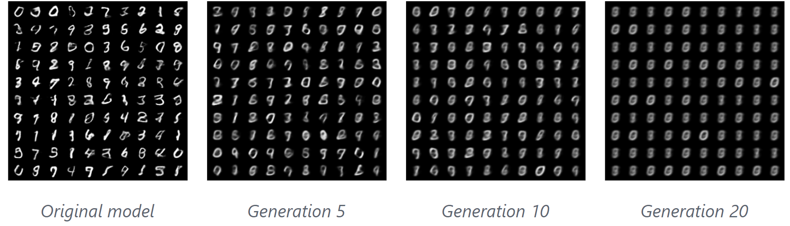

Scientists in the 1940s encountered a particular problem: newly-produced equipment for detecting radiation was recording a **faint but constant signal**, making it impossible to detect radiation below a certain threshold, limiting its sensitivity. Nothing had changed about their manufacturing process, so what was the culprit? The cause - it was later discovered - were **early nuclear weapon tests**. During these events, large quantities of radioactive material were released into the atmosphere. These radioactive particles quickly spread and dispersed slightly raising atmospheric background radiation. Steel production requires large amounts of oxygen. After the nuclear tests in 1945, it was no longer possible to extract it from the atmosphere without also capturing some radioactive particles. These detectors were not reading some unknown external signature, they were reading **radioactivity from their own metal parts**. A sudden event had changed **something** about the fundamental materials these devices were made out of, rendering them less accurate. Manufacturers started to seek out steels produced before the critical date of the first nuclear test, a material now known as [low-background steel](https://qz.com/emails/quartz-obsession/1849564217/low-background-metal-pure-unadulterated-treasure). Something similar is happening, right under our noses, with Large Language Models.

<i>Figure 1: WW1 warships were often used as a source of low background steel.</i>

**Large Language Models (LLMs)** have quickly spread and become ubiquitous in our day-to-day lives. These complex machines are built by **pre-training** on large swathes of the web, and then by **fine-tuning** on a specific task (for example summarizing the main points of a piece of text). Conversational agents like ChatGPT are further tuned using a technique called **Reinforcement Learning from Human Feedback**, which precisely aligns the output of these assistants with how we expect them to behave. This intricate process has made them valuable tools for many jobs ranging from coding to creative writing.

This pervasiveness might paradoxically become dangerous for LLMs, hindering their birth and development. LLMs are creating an environment that is **toxic** for their own survival, and every piece of generated text that gets uploaded further **intensifies the problem**. How come?

## Model collapse
Imagine printing a picture, then scanning it, then printing the result, then scanning it... What would the resulting image would look like after repeating this process dozens of times? What if instead of a printer and a photograph you had a LLM and some text? 

A group of researchers at Oxford, Cambridge, ICL and University of Toronto asked themselves a very simple question: "What would happen if a generative model **learned** from the same data it **generated**?". To answer, they first trained a LLM on some data and then used it to generate additional training samples. Then, they trained a new model from scratch on this generated data, and used it to produce the next iteration of training data, repeating the process over and over. At first, nothing bad happened, with only a slight decrease in performance. But then, after enough generations, the model started producing incoherent results and meaningless sentences. With every iteration, the model forgot less common sentences in favor of more frequent ones, flattening the variety of generated samples and further hindering the training of next iterations. This phenomenon was named [**model collapse**](https://arxiv.org/abs/2305.17493).

What's even scarier is that model collapse was observed in other radically **different models** as well. First they experimented on a simple gaussian mixture trying to predict a one-dimensional distribution, then they turned to a Variational Auto Encoder (VAE) for digit generation (the famous MNIST dataset). Across all models, the same patterns emerged: subsequent generations captured **less and less information** from the initial data, resulting in useless models.

<i>Figure 2: Model collapse on VAE for MNIST.</i>

The **cure to collapse**, researchers say, is to keep feeding the models a large proportion of **high-quality data** such as textbooks and articles. This could prevent or at least slow down model collapse until a solution is found. The problem is, we might be soon **running out** of such high-quality data, some estimate as soon as **2026**.

You may think of model collapse as a far-fetched issue that may or may not become significant in decades. Model-generated data is not that pervasive and should not contaminate the natural one for at least a few years, right? Unfortunately, it seems that this process is **already taking place**. Amazon Mechanical Turk (AMK) is a crowdsourcing website often used to build NLP datasets. Users can help labeling data and in exchange they receive a small compensation. A group of researchers at EPFL discovered that between **33% and 46%** of annotator workers used LLMs when completing the task. The choice of task - text summarization - was particularly suited to be automated using LLMs. Crowd workers started prompting ChatGPT in an attempt to complete the task faster, thus earning more. Much like in the low background steel case, it's becoming increasingly difficult to obtain genuine human-made data. A very recent study also found that traffic to Stack Overflow has been steadily going down since the release of ChatGPT, reaching **-13.9%** in [March 2023](https://www.similarweb.com/blog/insights/ai-news/stack-overflow-chatgpt/). Another variation on this same phenomena affects image generation models: platforms like Instagram or Artstation are being flooded with machine generated content, often without a way to tell it apart from natural data. 

## Implications

Models collapse. So what? An immediate consequence we would observe is a decrease in model performance and an increase in hallucinations. Collapsed models tend to generate from a much narrower distribution than its "healthy" counterparts, exhibiting much less variation and nuanced outputs, much like a book whose pages have been torn out. And this process would **accelerate** the more narrow data generated by the model is added to the pool of the next one.

Human language is very complicated. The full range of human written production is made out of poetry, jokes, prose, and infinitely many other unique pieces of expression. A model that learns to write from its own output, losing one page of its book after the other, would soon forget all the richness and variety that made human language complicated in the first place. The first text to be forgotten would be the most rare, creative and precious. Less frequent sentences and styles will disappear in favor of a standard, flatter prose that yields better performance during training. Creativity will be considered an **outlier to correct**. [Citing Ted Chiang](https://www.newyorker.com/tech/annals-of-technology/chatgpt-is-a-blurry-jpeg-of-the-web): "*the more that text generated by large language models gets published on the Web, the more the Web becomes a blurrier version of itself*".

Let's go further, maybe a bit too much. What happens when this blurry picture is fed back to the human in the loop? What happens when we start using these machines as **teaching tools** when learning a new language? Human beings are somewhat similar to LLMs in the sense that they read, learn and produce new ideas based on their experiences. We might become an **active part** of this spiral, generating unoriginal content ourselves and feeding it to the machine teaching us, flying faster and faster towards model collapse, like a **snake biting its own tail**.

## A silver lining

This articles depicts a rather bleak future. Luckily, model collapse might not be so certain nor dangerous. A separate group from Microsoft Research recently trained a LLM on generated data from GPT-4, reaching comparable and in some cases **superior** performance to ChatGPT. While it's true that the performance of the new model didn't match the original, larger one, it's also true that it was able to retain most of its capabilities to a significant degree. This may suggest that model collapse is further away than we think. Another reason for reassurance is the fact that the strongest effects of model collapse were observed only in the extreme case where **all** of the training data of consecutive models was **generated** by the previous one and no "fresh" data was added to the dataset. This is not the case in reality, where machine generated data make up only a small portion of all content available on the web. We might also circumvent the issue of stale data altogether by creating methods to detect machine-generated data.

A more speculative reason why model collapse might not be so catastrophic is the fact that human language is extremely **complicated**. So much, in fact, that the possibility of models forgetting useful parts of language to a detectable degree is remote. Moreover, language evolves creating new unique combinations the model has never seen before. Lastly, despite the fact that humans will most certainly use LLMs for learning, that remains a small fraction of the total amount of information a person absorbs during its life. Novelty and creativity will always be driven by **unique experiences**, not just by a machine typing words.

## Conclusion

The objective of this article is to serve as a cautionary tale, raising awareness about a possible problem we will encounter in the future, and possibly encouraging you to read more about it and maybe find a solution! LLMs are becoming more and more pervasive in our lives, and little is known about the consequences they will have on society. Maybe they will shape human production in a duller and boring way, or maybe they'll evolve alongside the ever changing languages of the world. The deciding factor lies in how well we'll desing their learning process. Outliers are not friends of this optimization algorithm. Yet, they are exactly what makes human production interesting. Not every anomaly is a mistake, and this, LLMs have not yet learned.